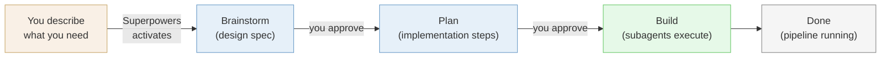
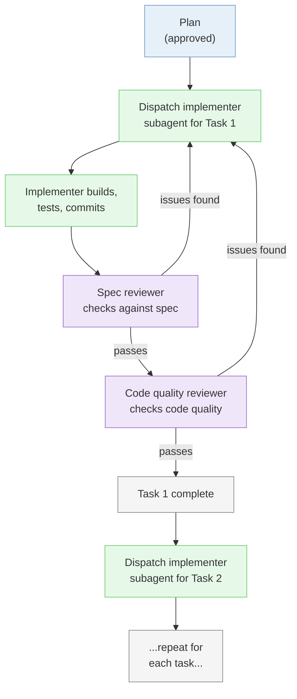

# Mini-Project 02: Cloud Extraction Pipeline Tutorial

This tutorial covers all four sessions of Mini-Project 02. If you fall behind during class, use this tutorial to catch up. Every command and prompt is written out so you can follow along on your own.

## Table of Contents

**Part 1: Extract and Load (Session 01)**

| Step | Topic | What You Will Do |
|------|-------|-----------------|
| 1 | [Create repo and start Claude Code](#step-1-create-github-repo-and-clone-into-cursor) | Set up the project repo, ensure Docker is running, start Claude Code |
| 2 | [Install Superpowers](#step-2-install-superpowers) | Add the Superpowers plugin to Claude Code |
| 3 | [Brainstorm the pipeline](#step-3-brainstorm-the-pipeline) | Design the pipeline with Superpowers brainstorming and a diagram |
| 4 | [Implement the pipeline](#step-4-implement-the-pipeline) | Set up CLAUDE.md, add credentials, let Superpowers build the pipeline |
| 5 | [Verify the data](#step-5-verify-the-loaded-data) | Check the results with psql, DBeaver, and Claude Code |
| 6 | [Update CLAUDE.md](#step-6-update-claudemd) | Run /init to capture the full project context |

**Part 2: Moving to the Cloud (Session 02)**

| Step | Topic | What You Will Do |
|------|-------|-----------------|
| 7 | [Verify AWS setup](#step-7-verify-aws-setup) | Confirm AWS CLI works, configure credentials |
| 8 | [Create RDS via Console](#step-8-create-rds-via-the-aws-console) | Build a cloud PostgreSQL database through the AWS web interface |
| 9 | [Recreate RDS via CLI](#step-9-delete-console-instance-recreate-via-cli) | Delete the Console instance, recreate with one CLI command |
| 10 | [Load raw data into RDS](#step-10-load-raw-data-into-aws-rds) | Extract all Basket Craft tables and load into cloud PostgreSQL |
| 11 | [Verify the data](#step-11-verify-the-loaded-data) | Check results with DBeaver and Claude Code |
| 12 | [Update documentation](#step-12-update-documentation-and-push) | Run /init, update README, commit and push |

**Part 3: Snowflake Load (Session 03)**

| Step | Topic | What You Will Do |
|------|-------|-----------------|
| 13 | [Verify your Snowflake account](#step-13-verify-your-snowflake-account) | Log in, confirm region and edition, copy account identifier |
| 14 | [Create Snowflake objects](#step-14-create-snowflake-objects) | Build warehouse, database, and schema with one worksheet |
| 15 | [Store Snowflake credentials](#step-15-store-snowflake-credentials-in-env) | Add Snowflake variables to `.env`, confirm gitignored |
| 16 | [Brainstorm the loader](#step-16-brainstorm-the-rds-to-snowflake-loader) | Use Superpowers to design the RDS-to-Snowflake hop |
| 17 | [Implement the loader](#step-17-implement-the-loader) | Let Claude Code write the Python loader based on the plan |
| 18 | [Run and verify](#step-18-run-the-loader-and-verify) | Load all tables, confirm row counts match RDS |
| 19 | [Commit and push](#step-19-commit-push-and-update-claudemd) | Update CLAUDE.md, commit, push to GitHub |

**Part 4: dbt Core and Star Schema (Session 04)**

| Step | Topic | What You Will Do |
|------|-------|-----------------|
| 20 | [Install dbt Core](#step-20-install-dbt-core) | Install `dbt-snowflake` and update requirements.txt |
| 21 | [Initialize the dbt project](#step-21-initialize-the-dbt-project) | Run `dbt init`, tour the folder structure |
| 22 | [Configure profiles.yml with env_var](#step-22-configure-profilesyml-with-env_var) | Wire dbt to Snowflake without committing secrets |
| 23 | [Declare raw tables as sources](#step-23-declare-the-raw-tables-as-dbt-sources) | Create `_sources.yml` for the four raw tables |
| 24 | [Build the staging layer](#step-24-build-the-staging-layer) | One staging model per source: rename and cast only |
| 25 | [Build the star](#step-25-build-the-star--fact-and-dimensions) | `fct_order_items` + `dim_customers` + `dim_products` + provided `dim_date` |
| 26 | [Add a dbt test](#step-26-add-a-dbt-test) | Declare unique + not_null on the fact table primary key |
| 27 | [Run dbt and verify](#step-27-run-dbt-and-verify-in-snowflake) | `dbt run`, `dbt test`, check results in Snowsight |
| 28 | [Generate the lineage graph](#step-28-generate-and-view-the-lineage-graph) | `dbt docs generate && dbt docs serve` |
| 29 | [Commit and push](#step-29-commit-push-and-update-claudemd-1) | Final commit, update CLAUDE.md, push |

---

## Part 1: Extract and Load (Session 01)

### Step 1: Create GitHub Repo and Clone into Cursor

In MP01, you built a project folder from scratch and added git later. This time you start the professional way: create the GitHub repository first, clone it to your machine, and then start building inside it.

**Why repo-first:** In professional work, you create the repository before writing any code so every change is tracked from the start. This is the workflow you will use for every project from now on.

You also need Docker running, since you will create a new local PostgreSQL container for this project.

**What to do:**

1. Go to [github.com/new](https://github.com/new) and create a new repository:
   - Name it `basket-craft-pipeline`
   - Set visibility to **Public**
   - Under **Add .gitignore**, select **Python** from the dropdown
   - Leave everything else as default (no README, no license)
   - Click **Create repository**

2. On your new repository's GitHub page, click the green **Code** button, make sure **HTTPS** is selected, and click the copy icon to copy the URL.

3. Clone the repo into Cursor. Open a new Cursor window and click **Clone repo** on the welcome screen. Paste the URL you just copied.

   If you do not see the welcome screen, you can also clone from the menu: **File > New Window**, then click **Clone repo**. Or use the command palette (Mac: `Cmd+Shift+P`, Windows: `Ctrl+Shift+P`) and search for "Git: Clone".

   When Cursor asks where to save it, navigate to your `isba-4715` folder inside your home directory (the same parent folder from MP01). Open the cloned folder when prompted.

   Your folder structure should now look like:
   ```
   ~/isba-4715/
   ├── campus-bites-pipeline/     <-- MP01
   └── basket-craft-pipeline/     <-- MP02 (this project)
   ```

4. Open a terminal in Cursor (`` Ctrl+` `` or **Terminal > New Terminal** from the menu bar).

5. Make sure Docker Desktop is open and running. If you do not have it installed (maybe you skipped MP01 or uninstalled it), follow the installation instructions in [MP01 Step 3](../06-local-pipeline/mp01-tutorial.md#step-3-install-docker) before continuing. It takes about 5 minutes.

   If your MP01 container (`campus_bites_db`) is running, stop it first. In Docker Desktop, go to **Containers**, find it, and click the Stop button. Or run `docker stop campus_bites_db` in your terminal. Two PostgreSQL containers cannot use the same port, and both default to 5432.

6. Confirm you are in the correct directory. Your terminal prompt should show `basket-craft-pipeline`. If not, navigate there and then start Claude Code:
   ```bash
   cd ~/isba-4715/basket-craft-pipeline
   claude
   ```
   Claude Code will ask if you trust this folder. Select **Yes, I trust this folder** and press Enter.

7. Set the output style to explanatory mode. Type:
   ```
   /config
   ```
   Use the arrow keys to select **Output style**, press Enter, then select **Explanatory** and press Enter again. This tells Claude Code to explain what it is doing as it works, so you learn the tools instead of just watching code appear. You only need to set this once. It persists across sessions.

**Checkpoint:** Your repo is cloned and open in Cursor. Docker Desktop is running. Claude Code is active in the terminal with explanatory output style.

---

### Step 2: Install Superpowers

In MP01, you used Claude Code with basic prompts: "do this," "build that." You described what you wanted and it generated the code. That works well for straightforward tasks.

But when you are building a pipeline with multiple moving parts (a source database, extraction scripts, transformations, a destination database), it helps to think through the design before writing code. [Superpowers](https://github.com/obra/superpowers) is a plugin for Claude Code that adds structured workflows for exactly this. The main one you will use today is brainstorming, which walks you through a design conversation and produces a blueprint before any code gets written.

**What to do:**

1. In your Claude Code session, install the Superpowers plugin. Type:

   ```
   /plugin install superpowers@claude-plugins-official
   ```

   Follow the prompts to complete the installation.

2. Once installed, verify that it worked by typing `/super` in the Claude Code prompt. You should see autocomplete suggestions that include Superpowers commands like `/using-superpowers`. If you see them, the install worked.

**Why this matters:** Superpowers adds structured skills to Claude Code that activate automatically. When you describe something you want to build, Superpowers will recognize the situation and start a **brainstorming** conversation before jumping to code. You do not need to type a special command. Just describe what you need and Claude Code will announce which skill it is using. The two skills we will learn in this course are:
- **Brainstorming:** Design before you build. Have a conversation about what you are trying to accomplish, and end up with a pipeline diagram and a plan. You will use this today.
- **Writing plans:** Break complex work into steps. You will learn this one in a later session.

Superpowers has many other skills (debugging, code review, testing, and more), but these two are the ones we will use in class.

In MP01, you told Claude Code *what* to build. With Superpowers, it first discusses *what and why* with you, then builds. Here is the full workflow:



You approve at two checkpoints (after the spec and after the plan), then Superpowers builds autonomously. Over the next few sessions, you will learn progressively more structured ways to work with Claude Code. Each one builds on the last.

**Checkpoint:** Superpowers is installed. You see Superpowers commands in the autocomplete when you type `/super`.

---

### Step 3: Brainstorm the Pipeline

Before writing any code, you are going to design the pipeline. In MP01 Step 5, you let Claude Code ask you questions to explore the problem. That was freeform. This time, Superpowers will automatically activate its brainstorming skill when it sees you describing something you want to build. Instead of jumping to code, Claude Code will start a structured design conversation that produces a **written design spec**, a document that gets saved to your project and committed to git. The spec defines everything needed to build the pipeline: architecture diagram, file structure and responsibilities, table schemas, SQL for aggregations, Docker and credential configuration, error handling, and testing strategy. Because the spec defines every file and its job, implementation in Step 4 is just executing the spec.

Here is the important part: **your design will probably look different from the instructor's and from your classmates'.** That is how real engineering works. Two people given the same business question will make different decisions about which tables to pull, how to aggregate, and how to structure the scripts. As long as your pipeline answers the business question, your design is valid.

**What to do:**

1. In Claude Code, type:

   ```
   I need to build a data pipeline. The Basket Craft team wants a
   monthly sales dashboard with revenue, order counts, and average
   order value by product category and month.

   Source: Basket Craft MySQL database.
   Destination: local PostgreSQL in Docker.

   Create a diagram of the pipeline, then help me plan
   the extraction and transformation.
   ```

   Claude Code will announce that it is using the brainstorming skill. This is Superpowers at work. It recognized that you are describing something you want to build and activated the right workflow automatically.

   Claude Code may also offer to open a **visual companion** in your browser for showing diagrams and mockups. If it asks, say yes and open the `localhost` URL it provides. If it does not offer, that is fine. The brainstorm will work in the terminal either way.

2. Claude Code will start a design conversation and ask about your setup. The brainstorm is a back-and-forth conversation, not a single prompt. Claude Code will ask you questions one at a time. Answer each one, and if it suggests something you do not understand, ask it to explain. A typical brainstorm takes 4-8 exchanges before producing the final diagram and plan.

   Be honest about your setup. If something from MP01 is broken or missing, tell the brainstorm. It will include fix-it steps in the pipeline design. That is one of the advantages of designing before building.

   Here is how to respond to common questions:

   - **When it asks about the source database:** Tell it the connection details you have been using all semester for the Basket Craft MySQL database. The credentials are the same ones from Lessons 01-05. The instructor will share them in the Zoom chat and the Teams channel.

   - **When it asks about the destination:** Tell it you need a local PostgreSQL database running in Docker for this project. The brainstorm will include a `docker-compose.yml` and container setup as part of the pipeline design. This is a new container separate from your MP01 project.

   - **When it asks about the transformation:** Explain that you need aggregated summary tables for a sales dashboard. Revenue, order counts, and average order value grouped by product category and month.

   - **When it asks about anything else:** Answer based on what you know. If you are unsure about something, say so. That is what the brainstorm is for.

3. The brainstorm will present the design in sections for you to review and approve. The final written spec will include:
   - A **pipeline diagram** (source -> extract -> transform -> load -> destination)
   - **File structure** and what each script is responsible for
   - **Table schemas** and SQL for aggregations
   - **Docker and credential configuration**
   - **Error handling** and **testing strategy**

   Review each section critically. If it misses something (for example, it only extracts one table when you need data from both orders and products to get category information), push back: "I think we also need the products table to get category names. Can you update the spec?" The brainstorm is a conversation, and you can steer it.

4. If the brainstorm has not yet produced a pipeline diagram, ask for one:

   ```
   Create a diagram of the pipeline we just designed.
   ```

5. Once you approve the final spec, Superpowers will write it to a file in your project (typically in a `docs/` folder) and commit it.

6. **Open the spec file in Cursor and read it.** This is the blueprint for your entire pipeline. Check that it makes sense to you:
   - Does the pipeline diagram match what you discussed?
   - Do the table schemas include the columns you expect?
   - Does the aggregation SQL produce the metrics the business question asks for (revenue, order counts, avg order value by category and month)?
   - Are the file names and responsibilities clear?

   If something looks wrong, tell Claude Code what to fix. The spec is easier to correct now than after the code is written. Once you are satisfied, Superpowers will transition to planning and implementation in Step 4.

**Your design vs. the instructor's:** The instructor will show their pipeline design during class. Your design may extract different tables, aggregate in a different order, or structure the scripts differently. The grading criteria is not "does it match the instructor's approach" but "does it answer the business question: monthly revenue, order counts, and average order value by product category?"

**Why this matters:** In MP01, the tutorial told you exactly what to build. That was appropriate for learning the tools. Now you are learning a harder skill: deciding what to build. The brainstorming conversation is practice for the design thinking you will need for your independent project and for real engineering work after graduation.

Superpowers may have already committed the spec for you. If not, commit and push now:

```
Commit all files and push to GitHub.
```

**Checkpoint:** You have a written design spec committed to your project and pushed to GitHub. It defines every file, schema, and configuration needed to build the pipeline. Superpowers is ready to transition into planning and building.

---

### Step 4: Implement the Pipeline

Your brainstorm produced a design spec. Now Superpowers will transition into planning and execution.

**Spec vs. plan:** The spec is *what* to build and why: the design decisions, schemas, architecture, and trade-offs. It is the agreement on what the system looks like when it is done. You wrote this during brainstorming. The plan is *how* to build it, step by step: the exact files to create, the exact code to write, the exact commands to run, in what order. A spec could be implemented many different ways. The plan picks one way and spells it out so precisely that someone (or an agent) with zero context could follow it mechanically.

Superpowers writes the implementation plan based on the approved spec, then builds using **subagent-driven development**. Instead of doing everything in one long conversation, Claude Code spawns fresh mini-agents (subagents) for each task:



Each subagent gets just the context it needs for its task, avoiding conversation history bloat. You will see messages like "Dispatching implementer for Task 1..." as it works through the plan. You will also see a **Base SHA** at the start, which is a git commit hash that Superpowers saves as a snapshot before building, so it can roll back if something goes wrong. You do not need to prompt for each piece. Just watch it work and answer questions if it asks.

Before it starts building, there are two things you need to set up manually.

**What to do:**

1. Create a `CLAUDE.md` file for your project. This is a file in your project root that Claude Code reads at the start of every session. It contains persistent instructions for this project, like project-level preferences that you set once instead of repeating yourself. Tell Claude Code:

   ```
   Create a CLAUDE.md file with this instruction:
   Use a Python virtual environment to manage dependencies.
   ```

   This tells Claude Code to create and use a virtual environment automatically when it installs packages or runs scripts. You can add more project conventions to this file later.

2. Create a `.env` file in your project root. Right-click the file explorer, select **New File**, name it `.env`, and paste the credentials block the instructor shares in Zoom chat / Teams. It should look something like:

   ```
   MYSQL_HOST=...
   MYSQL_PORT=3306
   MYSQL_USER=...
   MYSQL_PASSWORD=...
   MYSQL_DATABASE=basket_craft
   ```

   Confirm that `.env` is listed in your `.gitignore` (the Python template you selected when creating the repo should already include it). This keeps credentials out of GitHub.

3. Approve the plan and let Superpowers build. After the brainstorm spec is approved, Superpowers will present an implementation plan. Review it, then approve it. Claude Code will start building: writing extraction scripts, transformation scripts, Docker configuration, and installing dependencies based on the approved spec.

   Let it work. If it asks questions, answer them. If it hits an error (connection issues, missing packages), it will fix and retry.

4. While Superpowers builds, confirm Docker is ready. Docker Desktop should still be open from Step 1, and your MP01 container should be stopped so port 5432 is free.

**After the build completes, review what was built:**

5. **Verify credentials stayed out of the code.** Open the generated Python scripts in Cursor and look for the database password. It should not appear in any `.py` file, only in the `.env` file. If it does:

   ```
   Move the credentials out of the script and read from the .env file.
   ```

6. Review the generated code in Cursor. You should be able to identify:
   - How the extraction script connects to the MySQL database and which tables it pulls
   - The aggregation logic in the transformation: GROUP BY, SUM, COUNT, AVG
   - How data flows from extraction to transformation to loading into PostgreSQL

**Your file structure vs. your classmates':** Your brainstorm may have produced a different file structure than others. Some pipelines use one script for everything, others separate extraction, transformation, and loading into different files. What matters is that the pipeline extracts, transforms, and loads correctly.

**What you are really building:** The summary tables you produce have measures (revenue, order count, average order value) grouped by dimensions (product category, month). If that sounds like it has a formal name, it does. These are the building blocks of a star schema, the standard structure for data warehouses. You will learn the vocabulary (fact tables, dimension tables, staging, marts) in Session 04 with dbt. For now, just notice the pattern: measures grouped by dimensions.

Superpowers may have already committed during the build. If not, commit and push now:

```
Commit all files and push to GitHub.
```

**Checkpoint:** The pipeline has been built and run. Extraction pulled data from the Basket Craft MySQL database, transformation aggregated it, and loading put the summary tables into your local PostgreSQL. Claude Code confirms success with row counts or a summary. Your work is pushed to GitHub.

---

### Step 5: Verify the Loaded Data

The pipeline ran. But did it work correctly? You will check the loaded data three different ways. Each catches different kinds of problems.

**What to do:**

**Method 1: psql via Claude Code**

1. Ask Claude Code to connect to your local PostgreSQL and check the data:

   ```
   Connect to my local PostgreSQL using psql. Show me the tables,
   row counts, and a sample of rows from each table.
   ```

2. Review the output. Do the table names match what your brainstorm planned? Do the row counts seem reasonable for monthly aggregations?

**CLI through Claude Code:** Claude Code can run CLI tools like `psql` on your behalf. You ask a question, and it handles the connection, the SQL, and the output formatting. You do not need to memorize psql commands. You will use this same pattern with the AWS CLI, dbt, and Snowflake CLI in later mini-projects.

**Method 2: DBeaver**

1. Open DBeaver and create a new PostgreSQL connection. Click **New Database Connection** (or **Database > New Database Connection**), select **PostgreSQL**, and fill in the connection details from the `docker-compose.yml` that the brainstorm created in your project folder:
   - Host: `localhost`
   - Port, database name, username, and password: check your `docker-compose.yml`
   - Click **Test Connection** to verify, then **Finish**

   This is a different connection from MP01. This project has its own container with its own credentials.

2. Navigate to your database > **Schemas > public > Tables**. You should see the summary tables that your pipeline created.

3. Double-click a table to browse the data. Do the numbers look reasonable? If you see monthly revenue in the hundreds of thousands, does that match your intuition about Basket Craft's order volume?

**Method 3: Claude Code natural language queries**

1. Back in Claude Code, ask analytical questions about the loaded data:

   ```
   What product category had the highest total revenue? Which month had the most orders?
   ```

2. Compare the answers to what you see in DBeaver. They should match.

3. Try a question that directly tests the business requirement:

   ```
   Show me the average order value by product category for each month, sorted by month.
   ```

   This is the core of what the Basket Craft team asked for. If this query returns sensible results, your pipeline works. Notice the structure of what you built: numerical measures (revenue, order count, average order value) organized by descriptive categories (product category, month). This pattern has a name you will learn in Session 04.

**Three tools, three purposes:**

| Tool | Best for | When to use |
|------|----------|-------------|
| psql via Claude Code | Quick checks, row counts, schema inspection | First pass: did the tables get created with the right structure? |
| DBeaver | Browsing data visually, spotting obvious issues | Second pass: does the data look right when you eyeball it? |
| Claude Code natural language | Analytical questions, testing the business logic | Final pass: does the pipeline actually answer the business question? |

You used all three of these in MP01. The workflow is the same here, just with different data. Get comfortable switching between them. You will use the same approach in your independent project.

**Commit your work.** Now that the pipeline is verified, commit everything. Ask Claude Code:

```
Commit all project files and push to GitHub.
```

**Checkpoint:** The aggregated data is verified through all three methods. You can see monthly revenue, order counts, and average order value by product category. The pipeline answers the business question the Basket Craft team asked for. Your work is committed to git.

---

### Step 6: Update CLAUDE.md

In Step 4, you created a `CLAUDE.md` with a single instruction about virtual environments. Now that the pipeline is fully built, update it to capture the full project context. This way, the next time you (or anyone) starts Claude Code in this project, it will already know what the project is, how it is structured, and how to work with it.

**What to do:**

1. In Claude Code, type:

   ```
   /init
   ```

   This tells Claude Code to scan your project and update the `CLAUDE.md` file. It will look at your scripts, Docker config, database setup, and directory structure to build a complete project summary.

2. Open `CLAUDE.md` in Cursor and review what it generated. It should include the project purpose, file descriptions, database connection details, and how to run the pipeline.

3. Create a `README.md` for your project. Tell Claude Code:

   ```
   Create a README.md that explains what this project is, how to
   set it up, and how to run the pipeline.
   ```

   A good README means anyone who visits your GitHub repo can understand what they are looking at. This is the first thing recruiters and collaborators see.

4. Commit and push:

   ```
   Commit all files and push to GitHub.
   ```

**Why this matters:** A good `CLAUDE.md` saves you time in every future session. Instead of re-explaining your project, Claude Code reads the file and picks up where you left off. This is especially useful in Sessions 02, 03, and 04, where you will build on top of what you built today.

**Checkpoint:** Your `CLAUDE.md` reflects the full project and your `README.md` explains the project to anyone visiting the repo. Both are committed and pushed to GitHub.

---

## Homework: Prepare for Session 02

Before the next class, complete these two setup tasks. You will need both for Session 02, where you set up your own AWS infrastructure.

1. **Create an AWS account.** Go to [aws.amazon.com](https://aws.amazon.com/) and create a free-tier account. You will need a credit card on file, but we will only use free-tier resources in this course. If you already have an AWS account from another class, you are set.

2. **Install the AWS CLI.** Follow the instructions for your operating system:

   **Mac:**
   ```bash
   brew install awscli
   ```

   **Windows:** Download and run the installer from [aws.amazon.com/cli](https://aws.amazon.com/cli/)

   Verify the installation by running:
   ```bash
   aws --version
   ```

   You should see a version number like `aws-cli/2.x.x`.

These tools are prerequisites for Session 02. We cannot proceed without them, so do not wait until the day of class.

---

## Part 2: Moving to the Cloud (Session 02)

In Session 01, your database ran in a Docker container on your laptop. That is fine for development, but production data lives in the cloud. AWS (Amazon Web Services) is the most widely used cloud platform. Most companies you will work for use AWS, Azure, or Google Cloud to run their databases and pipelines.

In this session, you will create an AWS RDS (Relational Database Service) instance. RDS is a managed PostgreSQL database: same SQL you already know, but AWS handles the server, storage, and backups. You just connect and use it. Everything we do today is covered by the AWS free tier.

### Step 7: Verify AWS Setup

Session 02 picks up in the same `basket-craft-pipeline` project from Session 01. Before building anything in the cloud, confirm the AWS tools from homework are working.

**What to do:**

1. Open your `basket-craft-pipeline` project in Cursor (the same repo from Session 01).

2. Open a terminal (`` Ctrl+` `` or **Terminal > New Terminal**).

3. Check that the AWS CLI is installed:
   ```bash
   aws --version
   ```
   You should see `aws-cli/2.x.x`. If not, install it now. Mac: `brew install awscli`, Windows: download from [aws.amazon.com/cli](https://aws.amazon.com/cli/).

4. Configure your AWS credentials:
   ```bash
   aws configure
   ```
   Enter your AWS Access Key ID and Secret Access Key when prompted. For region, enter `us-east-1`. For output format, enter `json`.

   If you do not have an access key, log in to the AWS Console at [console.aws.amazon.com](https://console.aws.amazon.com/), go to **IAM > Users > your user > Security credentials > Create access key**.

5. Confirm your credentials work:
   ```bash
   aws sts get-caller-identity
   ```
   You should see your AWS account ID, user ARN, and user ID returned as JSON. If the output opens in a pager (you see a `:` at the bottom of the screen), press `q` to exit.

6. Now start Claude Code:
   ```bash
   claude
   ```
   Trust the folder if prompted.

**AWS credentials vs project credentials:** This project uses two separate sets of credentials. AWS credentials (access key and secret key) are stored in `~/.aws/credentials` by `aws configure`. They live at the machine level. They identify you to AWS and never belong in your project files. RDS database credentials (username and password for your cloud database) go in your project's `.env` file, the same as the MySQL credentials from Session 01. Never put AWS access keys in `.env` or any file tracked by git.

**Checkpoint:** `aws sts get-caller-identity` returns your AWS account info. Claude Code is running in your `basket-craft-pipeline` project.

---

### Step 8: Create RDS via the AWS Console

You are going to create a cloud database two ways. First through the AWS Console (the web interface) so you understand what every setting does. Then in Step 9, you will delete it and recreate the same thing with one CLI command. The Console creation is deliberately slow. The point is to feel the friction so the CLI speed hits harder.

**What to do:**

1. Open the AWS Console in your browser: [console.aws.amazon.com](https://console.aws.amazon.com/). Sign in with your AWS account.

2. Navigate to **RDS**: search for "RDS" in the top search bar, or find it under **Services > Database > RDS**.

3. In the left sidebar, click **Databases**. Then click **Create database** in the top right.

4. Under **Choose a database creation method**, make sure **Full configuration** is selected (not Easy create). Full configuration shows every setting so you can see what goes into creating a cloud database. That is the point of this step.

5. Configure the new database. The page has a lot of settings. Work through these sections from top to bottom (leave anything not listed as default):

   **Engine options:**
   - Select **PostgreSQL** (not Aurora PostgreSQL Compatible). Look for the PostgreSQL elephant icon.

   **Templates:**
   - Select **Free tier** (the third option). This auto-configures instance size and storage to stay within the free tier.

   **Settings:**
   - **DB instance identifier:** `basket-craft-console`
   - **Master username:** `student`
   - **Credential management:** select **Self managed**
   - **Master password:** `go_lions` (confirm it)

   **Instance configuration:**
   - Free tier should have pre-selected a burstable instance class (db.t3.micro or db.t4g.micro). Leave it.

   **Storage:**
   - Free tier should have set this to 20 GB. If it shows a larger number, change it to `20`.

   **Connectivity:**
   - **Compute resource:** leave as **Don't connect to an EC2 compute resource**
   - **Public access:** select **Yes**
   - **VPC security group:** select **Create new** and name it `basket-craft-sg`

   **Additional configuration** (expand this section near the bottom of the page):
   - **Initial database name:** `basket_craft`. If you skip this, the database won't exist and DBeaver won't be able to connect.

6. Click **Create database**. Provisioning takes 5-10 minutes.

7. While the instance is provisioning, edit the security group to allow connections. You can do this now because the security group was created immediately.
   - Click on the instance name and go to the **Connectivity & security** tab
   - Under **Security group rules**, click on the security group you created (`basket-craft-sg`)
   - Click the **Security group ID** link to open it
   - Go to **Inbound rules > Edit inbound rules**
   - Change the **Source type** dropdown to **Anywhere-IPv4**. The **Source** field will update to `0.0.0.0/0`
   - Click **Save rules**

   `0.0.0.0/0` is a CIDR block that means "any IP address." It allows connections from anywhere: campus, home, a coffee shop. For a free-tier learning database this is fine. In production you would restrict this to specific IP addresses.

8. Once the status shows **Available**, go to the **Connectivity & security** tab and copy the **Endpoint** (it looks like `basket-craft-console.xxxx.us-east-1.rds.amazonaws.com`).

9. Open DBeaver and create a new PostgreSQL connection:
   - Host: paste the endpoint you copied
   - Port: `5432`
   - Database: `basket_craft`
   - Username: `student`
   - Password: `go_lions`
   - Click **Test Connection** to verify, then **Finish**

10. You should see an empty `basket_craft` database. This is a PostgreSQL database running in the cloud, not on your laptop.

**Not for production:** Public access and an open security group (0.0.0.0/0) are fine for a free-tier learning database. In production, you would restrict access to specific IP addresses or use a VPN. We are keeping it simple so you can connect from campus, home, or anywhere.

**Checkpoint:** Connected to the Console-created RDS instance (`basket-craft-console`) in DBeaver. Empty database, accessible from your machine.

---

### Step 9: Delete Console Instance, Recreate via CLI

That took a while. Every dropdown, every setting, the provisioning wait. Now you are going to do the same thing with one command. Once AWS knows who you are (`aws configure`), Claude Code can create, modify, and delete cloud resources on your behalf.

**What to do:**

1. In Claude Code, delete the Console-created instance:

   ```
   Delete my AWS RDS instance called basket-craft-console.
   Skip the final snapshot.
   ```

2. Go back to the RDS Console in your browser and confirm the `basket-craft-console` instance is being deleted or has been deleted. You should see its status change to **Deleting**.

3. Now create a new one with the same settings:

   ```
   Create an AWS RDS PostgreSQL instance with these settings:
   - Instance identifier: basket-craft-db
   - Database name: basket_craft
   - Master username: student
   - Master password: go_lions
   - Free tier eligible instance class
   - Storage: 20 GB
   - Publicly accessible: yes
   - Security group: basket-craft-sg
   ```

4. Wait for the instance to become available. This is another provisioning wait, but notice the difference: the Console required your attention for every field. The CLI required one prompt. You are already done.

   Ask Claude Code to check the status:

   ```
   Check if my basket-craft-db RDS instance is available yet.
   ```

5. Once available, get the endpoint:

   ```
   What is the endpoint for my basket-craft-db RDS instance?
   ```

6. Open DBeaver, create a new PostgreSQL connection using the new endpoint (same credentials: `student` / `go_lions`, database `basket_craft`). Test the connection.

**Why CLI matters:** The Console is good for learning what settings exist. The CLI is good for everything else: faster, repeatable, scriptable, and auditable. You will use CLIs for most cloud operations from here on.

**Checkpoint:** Console instance deleted. CLI-created instance (`basket-craft-db`) is running and connected in DBeaver.

---

### Step 10: Load Raw Data into AWS RDS

You have a cloud database. Now fill it with data. You will extract all raw Basket Craft tables from the instructor's MySQL database and load them into your AWS RDS PostgreSQL. Same source as Session 01, different destination.

**What to do:**

1. Add your RDS credentials to the `.env` file. Open it in Cursor and add these lines (keep the existing MySQL credentials):

   ```
   RDS_HOST=basket-craft-db.xxxx.us-east-1.rds.amazonaws.com
   RDS_PORT=5432
   RDS_USER=student
   RDS_PASSWORD=go_lions
   RDS_DATABASE=basket_craft
   ```

   Replace the `RDS_HOST` value with your actual endpoint from Step 9.

2. Tell Claude Code to load the data:

   ```
   Extract all raw tables from the Basket Craft MySQL database and
   load them into my AWS RDS PostgreSQL. Read the MySQL and RDS
   credentials from the .env file. Load all tables as-is, no
   transformations, just raw data.
   ```

3. Let Claude Code work. It will adapt your existing extraction scripts or write new ones. If it asks questions, answer them. If it hits connection errors, let it fix and retry.

**Superpowers may brainstorm again.** Even though this task is straightforward, Superpowers may activate the brainstorming skill because it detects you are building something. That is fine. The brainstorm will be shorter than Session 01 since the task is simpler (same source, new destination, no design decisions). Let it work through its process.

**Raw data for a reason:** You are loading raw, untransformed data. In Session 03, dbt will transform this into a star schema (fact and dimension tables). Raw data goes in first, transformations happen in the warehouse. That is the ELT pattern. Loading raw now means you have the full source to work with later.

**Checkpoint:** All 8 raw Basket Craft tables are loaded into the AWS RDS. Row counts per table match the source MySQL database.

---

### Step 11: Verify the Loaded Data

Check the data before calling it done. This time the database is remote.

**What to do:**

**Method 1: Claude Code**

1. Ask Claude Code to check the data:

   ```
   Connect to my AWS RDS PostgreSQL and show me all tables
   with their row counts.
   ```

2. Compare the row counts to what you expect from the source MySQL database.

**Method 2: DBeaver**

1. In DBeaver, refresh your connection to the `basket-craft-db` instance (right-click > **Refresh**).

2. Navigate to **basket_craft > Schemas > public > Tables**. You should see all 8 tables.

3. Open a few tables and browse the data. Does it look like the same Basket Craft data you queried in Lessons 01-05?

**Method 3: Claude Code natural language queries**

1. Ask an analytical question about the data in your RDS:

   ```
   Using my AWS RDS, what are the top 5 products by total revenue?
   ```

2. Compare the answer to what you would expect from the source data.

**Same three tools, same reasons:**

| Tool | What to check | Why |
|------|---------------|-----|
| Claude Code | Row counts per table | Quick programmatic check: did all 8 tables load? |
| DBeaver | Browse rows visually | Spot-check: does the data look right? |
| Claude Code (natural language) | Analytical question | Business check: do the numbers make sense? |

**Checkpoint:** Data verified. All 8 tables present in the AWS RDS with row counts matching the source MySQL database.

---

### Step 12: Update Documentation and Push

The pipeline works. Your data is in the cloud. Update your project documentation to reflect what you built. After every implementation session, run `/init` and update the README.

**What to do:**

1. Run `/init` in Claude Code to update the `CLAUDE.md` file. It will detect the new AWS RDS connection and scripts.

2. Review the updated `CLAUDE.md` in Cursor. It should now mention both the local Docker PostgreSQL (from Session 01) and the AWS RDS you just created. Check that it has the RDS endpoint, database name, and how to connect.

3. Update the README:

   ```
   Update the README.md to reflect that the project now includes
   an AWS RDS PostgreSQL database with raw Basket Craft data.
   ```

4. Commit and push:

   ```
   Commit all files and push to GitHub.
   ```

**Why documentation matters:** Every time you add infrastructure or change how the project works, update the docs. Your future self, your classmates, and recruiters looking at your GitHub will thank you. A repo with outdated docs is worse than a repo with no docs, because at least no docs is honest.

**Checkpoint:** CLAUDE.md reflects the AWS RDS addition. README is updated. All work is committed and pushed to GitHub.

---

## Homework: Prepare for Session 03

Sign up for a Snowflake trial account before the next class.

1. Go to [signup.snowflake.com](https://signup.snowflake.com/) and fill in the signup form. You only need a valid email address. No credit card required. The trial lasts 30 days.

2. **Before clicking Sign up**, look below the Sign up button. You will see the current edition, cloud provider, and region (e.g., "Enterprise Edition . AWS US East (Ohio)"). Click the `>` arrow next to it to change these settings:
   - **Edition:** Standard (not Enterprise, to stretch your free credits further)
   - **Cloud provider:** Amazon Web Services
   - **Region:** US East (Northern Virginia) (same region as your AWS RDS)

3. After signing up, log in to your Snowflake account and confirm you can see the Snowflake web interface (Snowsight).

This is required for Session 03. We cannot proceed without it.

---

## Part 3: Snowflake Load (Session 03)

In Session 02 you landed the Basket Craft raw tables in a cloud PostgreSQL database on AWS RDS. Today you move that same data one more hop — into a cloud data warehouse, Snowflake. You will not transform anything yet. Today is the **L** in ELT: extract from RDS, load into Snowflake raw. Next session is the **T**, where dbt takes over.

**Before this session:** Complete the [homework from Session 02](#homework-prepare-for-session-03) (Snowflake trial account signup). You should be able to log in to Snowsight, the Snowflake web UI, before class starts.

### Step 13: Verify Your Snowflake Account

Before we touch any code, confirm your Snowflake trial is set up correctly. Getting the region and edition wrong now will cause confusing failures later.

**What to do:**

1. Open a browser and go to [app.snowflake.com](https://app.snowflake.com). Log in with the account you created for homework.

2. Once logged in, look at the URL bar. It will look like `app.snowflake.com/us-east-1/XXXXXXX/...`. The `us-east-1` confirms you are in the same AWS region as your RDS database. If you see a different region, stop and message the instructor. We cannot proceed across regions.

3. In the top-left, click your account name to open the account menu, then click your username. You will see your account identifier in a format like `ORGNAME-ACCOUNTNAME`. Copy this — you will need it in Step 15.

4. In the left sidebar, click **Admin** > **Accounts**. Confirm your edition reads **Standard** (not Enterprise). Standard gives you more free credits to work with during the trial.

**Why this matters:** Snowflake's connection strings use the account identifier as the "hostname." Getting it right is the single most common failure point for first-time users. The region has to match your RDS region so your raw data does not cross regions (which is slow and, in production, expensive).

**Checkpoint:** You can log in to Snowsight, your region is `us-east-1`, your edition is Standard, and you have copied your account identifier somewhere you can find it.

---

### Step 14: Create Snowflake Objects

Snowflake separates four concepts that other databases bundle together: **warehouses** (compute), **databases** (storage containers), **schemas** (namespaces inside a database), and **roles** (access control). You will create one of each for this project.

In Snowsight, the tool for running SQL is a **worksheet**. Think of it like a query editor in DBeaver — you paste SQL, hit run, and see results.

**What to do:**

1. In Snowsight, click the **+** button in the top-left and choose **SQL Worksheet**. A new worksheet opens.

2. Paste the following SQL into the worksheet. Do not run it yet — read through the comments first so you understand what each statement does.

   ```sql
   -- Use the account admin role so we have permission to create objects
   USE ROLE ACCOUNTADMIN;

   -- Create a virtual warehouse (compute) for this project.
   -- XS is the smallest size. Auto-suspend after 60s idle to save credits.
   CREATE WAREHOUSE IF NOT EXISTS basket_craft_wh
       WAREHOUSE_SIZE = 'XSMALL'
       AUTO_SUSPEND = 60
       AUTO_RESUME = TRUE
       INITIALLY_SUSPENDED = TRUE;

   -- Create a database to hold all Basket Craft data
   CREATE DATABASE IF NOT EXISTS basket_craft;

   -- Create a schema called "raw" for the untransformed data
   CREATE SCHEMA IF NOT EXISTS basket_craft.raw;

   -- Switch to the new warehouse, database, and schema
   USE WAREHOUSE basket_craft_wh;
   USE DATABASE basket_craft;
   USE SCHEMA raw;
   ```

3. Select all the SQL (Cmd/Ctrl + A), then click the blue **Run** button in the top-right. You should see a sequence of "Statement executed successfully" messages in the results pane.

4. Verify your objects exist. In the left sidebar of Snowsight, click **Data** > **Databases**. You should see `BASKET_CRAFT` in the list. Expand it and you should see the `RAW` schema inside.

**Why this matters:** Warehouses, databases, and roles are orthogonal concepts in Snowflake. The same warehouse can serve many databases. The same role can have different permissions in different databases. Keeping them separate lets large teams share a single Snowflake account without stepping on each other. For this project you only need one of each, but the pattern is the same at any scale.

**Checkpoint:** You can see `BASKET_CRAFT` with a `RAW` schema inside it in the Snowsight Data browser. Your worksheet ran without errors.

---

### Step 15: Store Snowflake Credentials in `.env`

Your Python loader needs to connect to Snowflake, which means it needs credentials. Just like with RDS in Session 02, the credentials go in `.env`, and `.env` stays out of git forever.

**What to do:**

1. Open your project's `.env` file in Cursor. If you followed Session 02 it already contains your RDS credentials.

2. Add these new lines at the bottom (replace the placeholder values with your real ones from Step 13):

   ```
   SNOWFLAKE_ACCOUNT=your-account-identifier-here
   SNOWFLAKE_USER=your-snowflake-username
   SNOWFLAKE_PASSWORD=your-snowflake-password
   SNOWFLAKE_ROLE=ACCOUNTADMIN
   SNOWFLAKE_WAREHOUSE=basket_craft_wh
   SNOWFLAKE_DATABASE=basket_craft
   SNOWFLAKE_SCHEMA=raw
   ```

3. Confirm `.env` is still in your `.gitignore`. In Cursor, open `.gitignore` and look for a line that says `.env`. If it is missing, add it. If you are unsure, ask Claude Code:

   ```
   Check that .env is gitignored and never accidentally committed. Run git status and tell me if .env shows up.
   ```

**Why this matters:** Every credential you add to a project is a new way to leak secrets. The rule is simple and absolute: credentials live in `.env`, `.env` lives in `.gitignore`, and both the Python loader and (next session) dbt read from the same `.env`. One source of truth.

**Checkpoint:** Your `.env` has all seven Snowflake variables. `.env` is gitignored. `git status` does not show `.env` as a tracked file.

---

### Step 16: Brainstorm the RDS to Snowflake Loader

You already know how to write a Python loader — you built one in Session 01 and another in Session 02. This one is similar in shape (read from one database, write to another), but Snowflake has quirks that are worth thinking through before you code. Use the Superpowers brainstorming skill, just like Session 01.

**What to do:**

1. In your Claude Code session, start a brainstorm:

   ```
   I need to write a Python script that reads the Basket Craft raw tables from my AWS RDS PostgreSQL database and loads them into my Snowflake basket_craft.raw schema. Use the superpowers brainstorming skill. Ask me one question at a time.
   ```

2. Work through the brainstorm conversation. Expect questions about:
   - **Which tables** to load (answer: the same raw Basket Craft tables you loaded in Session 02)
   - **Chunking strategy** — do you pull everything into memory, or batch it? (For this dataset, in-memory is fine.)
   - **Idempotency** — if you run the loader twice, should it append or replace? (Answer: truncate-and-reload. Safer and simpler.)
   - **Column name casing** — Snowflake uppercases unquoted identifiers by default. We will use lowercase everywhere and never quote. This avoids the #1 dbt failure next session.

3. At the end of the brainstorm, Claude Code will summarize the plan. Read it carefully. If something does not match the above, push back before letting it write code.

**Why this matters:** Snowflake's ingestion model is different enough from PostgreSQL that "I'll just write what I wrote last time" is a trap. Brainstorming forces the design decisions to the surface before the code gets written.

**Checkpoint:** You have a clear plan in the Claude Code conversation that covers which tables, how to chunk, how to handle re-runs, and how to handle identifier casing.

---

### Step 17: Implement the Loader

Now you let Claude Code write the script based on the brainstorm.

**What to do:**

1. Tell Claude Code to implement the loader:

   ```
   Implement the loader we just designed. Use snowflake-connector-python's write_pandas to load each table. Read credentials from .env using python-dotenv. Keep all identifiers lowercase and unquoted. Add any new dependencies to requirements.txt.
   ```

2. Claude Code will create the loader script and update `requirements.txt` to add `snowflake-connector-python` (and `python-dotenv` if it is not already there). Review the file it creates before running anything. Ask yourself:
   - Is it reading credentials from `.env`?
   - Is it truncating each target table before loading?
   - Are all table and column names lowercase?
   - Is it using `write_pandas` for the writes?

3. Install the new dependencies:

   ```
   Install the new Python dependencies from requirements.txt into the project virtual environment.
   ```

**Why this matters:** One loader per hop. Session 01 had a loader from CSV to local PostgreSQL. Session 02 had a loader from CSV (or RDS) to cloud PostgreSQL. Today you have a loader from RDS to Snowflake. Each hop is a small, dumb, replayable script. If any single hop breaks, you can re-run it without touching the others. This is a pattern you will reuse for the rest of your career.

**Checkpoint:** Your repo contains a new Python file that loads RDS data into Snowflake. `requirements.txt` has been updated. Dependencies are installed. The script has not been run yet.

> ### What production teams do differently
>
> The Python loader you just wrote works perfectly well for this dataset. Most junior data engineering jobs will ask you to write one just like it on day one. But at scale, most companies use a different pattern.
>
> The most common production pattern is **object storage plus `COPY INTO`**: you dump raw data to S3 (or Azure Blob, or GCS) as CSV or Parquet files, then tell Snowflake to load those files with a single `COPY INTO` command. Snowflake reads many files in parallel, which is dramatically faster for large volumes. S3 also becomes a durable raw archive — if Snowflake ever loses a table, you re-load from the files. Tools like Fivetran, Airbyte, and Stitch are essentially managed wrappers around this pattern: they handle the "dump to S3" part for you and trigger the `COPY INTO`. Snowflake's own **Snowpipe** service automates `COPY INTO` whenever a new file lands in the bucket, giving you near-real-time ingestion.
>
> The secret is that `write_pandas` is already doing this under the hood. It serializes your DataFrame to Parquet files in a temporary Snowflake-managed stage, then fires a `COPY INTO` from that stage. Everything in Snowflake is `COPY INTO`. The only question is who is writing the files and where they land. We use `write_pandas` because it fits in one class session and is honest to the scale of this dataset. When your portfolio project or first job hits real scale, you will reach for S3 and `COPY INTO` directly — and the leap will be smaller than you expect.

---

### Step 18: Run the Loader and Verify

**What to do:**

1. Run the loader script from the Cursor terminal. Ask Claude Code to execute it:

   ```
   Run the Snowflake loader script and show me the output.
   ```

2. Watch the output. Expect to see one message per table ("Loaded X rows into orders," etc.). If you see errors, skip down to the troubleshooting section at the end of this part.

3. Verify the data landed. Go back to your Snowsight worksheet and run:

   ```sql
   USE DATABASE basket_craft;
   USE SCHEMA raw;

   SELECT COUNT(order_id) AS row_count FROM orders;
   SELECT COUNT(order_item_id) AS row_count FROM order_items;
   SELECT COUNT(product_id) AS row_count FROM products;
   SELECT COUNT(customer_id) AS row_count FROM customers;
   ```

4. Compare each row count to what you saw in RDS at the end of Session 02. They should match exactly. If any count is off, the loader has a bug — tell Claude Code which table is off and by how many rows, and work through it together.

**Why this matters:** Row-count parity between source and destination is the cheapest integrity check you can run. It will not catch subtle column-level bugs (wrong types, truncated strings), but it catches every gross failure: missing tables, silent errors, partial loads. Run it every single time you load data anywhere.

**Checkpoint:** Row counts in Snowflake match row counts in RDS for every table. You can see the tables in the Snowsight Data browser under `BASKET_CRAFT` > `RAW`.

---

### Step 19: Commit, Push, and Update CLAUDE.md

**What to do:**

1. Ask Claude Code to update `CLAUDE.md` to reflect the new Snowflake loader:

   ```
   Update CLAUDE.md to document the new Snowflake loader. Include how to run it, where its credentials come from, and the target database and schema. Do not commit any secrets.
   ```

2. Commit and push:

   ```
   Commit all changes and push to GitHub. The commit message should mention adding the Snowflake loader.
   ```

3. Confirm on GitHub that the loader script, updated `requirements.txt`, and updated `CLAUDE.md` all show up in your repo.

**Why this matters:** Every session in this project ends the same way: update `CLAUDE.md`, commit, push. This ritual keeps your repo in a shippable state at all times and gives future Claude Code sessions (and future classmates, and future recruiters) the context they need to understand your project without reading every file.

**Checkpoint:** Your repo on GitHub contains the Snowflake loader, updated `requirements.txt`, and an updated `CLAUDE.md` describing the new pipeline hop. Your working tree is clean.

---

### Troubleshooting Session 03

**"Could not connect to Snowflake — unknown host."** Your `SNOWFLAKE_ACCOUNT` value is wrong. Snowflake uses a format like `orgname-accountname` (newer accounts) or a legacy account locator like `abc12345.us-east-1.aws` (older accounts). You can find the exact value in Snowsight under **Admin** > **Accounts**, in the **Account Identifier** column. Copy that whole string into `.env`.

**"Region mismatch" or the Snowsight URL shows a different region than `us-east-1`.** You signed up for the wrong region. Unfortunately, Snowflake trial accounts cannot be moved between regions. Create a new trial account in AWS US East (Northern Virginia) and use that one.

**"SQL compilation error: Object does not exist" when the loader runs.** Your role does not have `USAGE` grants on the warehouse, database, or schema. As long as you are using `ACCOUNTADMIN`, this should not happen. If you switched to a custom role, run this in a worksheet:

```sql
GRANT USAGE ON WAREHOUSE basket_craft_wh TO ROLE YOUR_ROLE;
GRANT USAGE ON DATABASE basket_craft TO ROLE YOUR_ROLE;
GRANT USAGE ON SCHEMA basket_craft.raw TO ROLE YOUR_ROLE;
GRANT ALL ON SCHEMA basket_craft.raw TO ROLE YOUR_ROLE;
```

**"Connection refused" when reading from RDS.** The RDS security group from Session 02 only allows your old IP. If you changed networks (coffee shop, campus WiFi, VPN), your current IP is now blocked. Ask Claude Code to help you update the security group to allow your new IP.

**The loader runs but every row count is zero.** The RDS connection is probably pointing at an empty database. Check that your `.env` has the Basket Craft RDS credentials, not a leftover dev database.

---

## Homework: Prepare for Session 04

Nothing new to install. Come to Session 04 with your Snowflake raw tables loaded from Session 03. If your loader failed, message the instructor before class — we cannot start Session 04 without raw data in Snowflake.

---

## Part 4: dbt Core and Star Schema (Session 04)

Today your raw Basket Craft data moves from "sitting in Snowflake" to "modeled as a star schema you can actually analyze." The tool for the job is **dbt** (data build tool), the standard for SQL-based transformation in modern data teams. You will install dbt Core, point it at your Snowflake raw schema, and build a small star schema with a fact table and three dimension tables.

**Before this session:** Complete Session 03. Your Snowflake `basket_craft.raw` schema must contain the loaded Basket Craft tables.

### Step 20: Install dbt Core

dbt Core is an open-source Python package. You install it into the same virtual environment your loader uses, which means dbt and the Python loader share the same dependencies and the same `.env` file.

**What to do:**

1. In your Claude Code session, ask for dbt Core with the Snowflake adapter:

   ```
   Install dbt-snowflake into the project virtual environment and add it to requirements.txt. Confirm dbt is installed by running `dbt --version` and show me the output.
   ```

2. Read the output. You should see a dbt version number and the `dbt-snowflake` adapter listed.

**Why this matters:** dbt Core is a Python package, not a separate platform. Everything dbt does happens inside your repo and inside your Snowflake account. There is no external service to sign up for, no extra credentials to manage, and no place your models can "live" outside of git. If it is not in your repo, it does not exist.

**Checkpoint:** `dbt --version` prints a dbt Core version and shows `dbt-snowflake` as an installed adapter. `requirements.txt` has been updated.

---

### Step 21: Initialize the dbt Project

`dbt init` scaffolds a new dbt project with the standard folder layout. You run it once, read what it creates, and then you own the files.

**What to do:**

1. Ask Claude Code to initialize the dbt project inside your repo:

   ```
   From the repo root, run `dbt init` to create a new dbt project for Basket Craft. When it asks for a project name, use basket_craft. When it asks for a database adapter, pick snowflake. Skip any connection prompts — we will configure profiles.yml manually in the next step.
   ```

2. After it finishes, look at the new folder structure. You should see something like:

   ```
   basket_craft/
   ├── dbt_project.yml
   ├── models/
   │   └── example/
   ├── macros/
   ├── tests/
   ├── seeds/
   ├── snapshots/
   └── analyses/
   ```

3. Delete the `models/example/` folder — it contains tutorial models from dbt that you do not need:

   ```
   Delete the models/example/ folder inside the basket_craft dbt project. We will build our own models from scratch.
   ```

**Why this matters:** dbt's folder conventions are the whole API. `models/` holds SQL files that become tables or views. `tests/` holds custom tests. `macros/` holds reusable SQL snippets. Every dbt project on earth has this same shape, which means a dbt project you wrote last year is instantly legible to someone who has never seen your repo.

**Checkpoint:** You have a `basket_craft/` dbt project folder next to your Snowflake loader. The `models/example/` folder is gone. `dbt_project.yml` exists.

---

### Step 22: Configure `profiles.yml` with `env_var()`

dbt reads its connection details from a file called `profiles.yml`. By default, `profiles.yml` lives in `~/.dbt/` — **outside your repo**. This is not a mistake. It keeps credentials out of git permanently, no matter how careless you are with `git add`.

**What to do:**

1. Ask Claude Code to write `profiles.yml` using `env_var()` so it reads from the same `.env` file as your Python loader:

   ```
   Create ~/.dbt/profiles.yml for the basket_craft dbt project. Use env_var() to read all Snowflake credentials from the environment. The profile name should match what dbt init created. Use the warehouse, database, and role from my .env, and set the schema to "analytics" (not raw — that's where the transformed models will live). Show me the file when you're done.
   ```

2. Review the file. It should look roughly like this:

   ```yaml
   basket_craft:
     target: dev
     outputs:
       dev:
         type: snowflake
         account: "{{ env_var('SNOWFLAKE_ACCOUNT') }}"
         user: "{{ env_var('SNOWFLAKE_USER') }}"
         password: "{{ env_var('SNOWFLAKE_PASSWORD') }}"
         role: "{{ env_var('SNOWFLAKE_ROLE') }}"
         warehouse: "{{ env_var('SNOWFLAKE_WAREHOUSE') }}"
         database: "{{ env_var('SNOWFLAKE_DATABASE') }}"
         schema: analytics
         threads: 4
   ```

3. Test the connection from inside the dbt project folder:

   ```
   cd into the basket_craft dbt project and run `dbt debug`. Show me the full output.
   ```

   Expected: every check passes, including "Connection test: OK connection ok."

**Why this matters:** Credentials never commit. Python loader and dbt share one source of truth (`.env`). `env_var()` is the canonical dbt way to read secrets, and every dbt project you ever work on in your career will use it. Get comfortable with `dbt debug` — it is the universal "is my setup OK?" check and should be your first move when anything breaks.

**Checkpoint:** `dbt debug` reports all checks passing. Your `profiles.yml` lives in `~/.dbt/` and uses `env_var()` for every secret.

---

### Step 23: Declare the Raw Tables as dbt Sources

In dbt, "sources" are tables you did not create but want to reference. They are the boundary between data you don't own and data you model. Declaring your Snowflake raw tables as sources gives you lineage tracking, documentation, and the nice `{{ source('raw', 'orders') }}` syntax in your models.

**What to do:**

1. Ask Claude Code to create the sources file:

   ```
   Create a file at basket_craft/models/staging/_sources.yml that declares four Snowflake sources: orders, order_items, products, and customers. They all live in the basket_craft database, raw schema. Use the source name "raw". Add a brief description for each source.
   ```

2. Review the file. It should look like:

   ```yaml
   version: 2

   sources:
     - name: raw
       database: basket_craft
       schema: raw
       description: "Raw Basket Craft tables loaded from AWS RDS in Session 03."
       tables:
         - name: orders
           description: "One row per order."
         - name: order_items
           description: "One row per line item within an order."
         - name: products
           description: "Product catalog."
         - name: customers
           description: "Customer master."
   ```

**Why this matters:** Sources are the contract between your pipeline's "L" (load) and "T" (transform). They say: "These tables exist, I did not create them, and I am going to build on top of them." Every dbt model that references a source gets a lineage edge in the docs graph. You will see that graph in Step 29.

**Checkpoint:** `_sources.yml` exists under `models/staging/` and declares all four raw tables.

---

### Step 24: Build the Staging Layer

Staging models are the **rename-and-cast-only** layer. One staging model per source table. No joins. No filters. No aggregations. No calculations. Just clean column names, proper types, and nothing else. This discipline is the single biggest dbt win, and breaking it is the single biggest beginner mistake.

**What to do:**

1. Ask Claude Code to build four staging models:

   ```
   Create four staging models under basket_craft/models/staging/:
   - stg_orders.sql
   - stg_order_items.sql
   - stg_products.sql
   - stg_customers.sql

   Each model should:
   - Select from the corresponding source using {{ source('raw', 'table_name') }}
   - Rename columns to clear snake_case (order_id, customer_id, order_date, etc.)
   - Cast dates and timestamps to proper types if needed
   - Do NOT join, filter, aggregate, or compute anything. Just rename and cast.

   Keep all identifiers lowercase. Do not quote any identifiers.
   ```

2. Open each file and read it. If any model has a JOIN, a WHERE clause, or a calculated column, tell Claude Code to remove it. Staging is a discipline, not a suggestion.

> ### Why staging and marts are separate layers
>
> The first time you see the staging/marts split, it looks redundant. Why write `stg_orders` that just selects from `raw.orders` and renames a few columns? Why not go straight to the fact table?
>
> Because the staging layer is where you **pay the cost of cleanup once**. Every mart model that touches orders goes through `stg_orders`, so if the raw data gets a new column, or a column name changes, you fix it in exactly one place. If you skip staging and let every mart query the raw table directly, one upstream change breaks five downstream models.
>
> The rule — **one staging model per source, rename and cast only** — is boring on purpose. It prevents you from accidentally baking business logic into the cleanup layer. Business logic belongs in marts. Cleanup belongs in staging. When those two mix, your project rots from the inside, and six months later you cannot tell whether a number is wrong because the raw data is wrong or because the staging layer silently filtered something out.
>
> Wrong:
> ```sql
> -- stg_orders.sql -- DON'T DO THIS
> select
>     o.order_id,
>     o.order_date,
>     c.customer_name,
>     sum(oi.quantity * oi.unit_price) as order_total
> from {{ source('raw', 'orders') }} o
> left join {{ source('raw', 'customers') }} c on o.customer_id = c.customer_id
> left join {{ source('raw', 'order_items') }} oi on o.order_id = oi.order_id
> where o.order_status != 'cancelled'
> group by 1, 2, 3
> ```
>
> Right:
> ```sql
> -- stg_orders.sql -- DO THIS
> select
>     order_id,
>     customer_id,
>     order_date::date as order_date,
>     order_status
> from {{ source('raw', 'orders') }}
> ```
>
> The wrong version joins, filters, and aggregates — all of which belong in a mart. The right version is boring and correct.

**Why this matters:** Staging discipline is the habit that separates a dbt project you can maintain from one you can't. Your portfolio rubric explicitly requires "at least one staging model per source" for the same reason. Getting this right now will save you hours on your portfolio project.

**Checkpoint:** You have four staging models under `models/staging/`. None of them joins, filters, aggregates, or computes anything. Each one is a rename-and-cast of a single source.

---

### Step 25: Build the Star — Fact and Dimensions

The mart layer is where the interesting modeling happens. You will build one fact table at **order-item grain** (one row per line item within an order) and three dimension tables (customers, products, date). This shape — one fact table connected to several dimension tables — is called a **star schema** and it is the workhorse of analytical data modeling.

**Grain is the single most important decision in dimensional modeling.** The grain of your fact table is "what does one row mean?" In this project, one row of `fct_order_items` means "one product was sold as part of one order." Picking line-item grain (instead of order grain) is what lets you answer questions like "which products are most often bought together" or "which customers buy the most of product X." Order grain cannot answer those questions because it has thrown away the per-product detail.

**What to do:**

1. First, create the `dim_date` table using this provided snippet. Building a date dimension from scratch is a calendar-math rabbit hole that teaches nothing about dimensional modeling, so we give it to you. Create `basket_craft/models/marts/dim_date.sql` with these contents:

   ```sql
   {{ config(materialized='table') }}

   with date_spine as (
       select
           dateadd(day, seq4(), '2020-01-01'::date) as date_day
       from table(generator(rowcount => 3653))  -- ~10 years
   )

   select
       date_day,
       extract(year from date_day) as year,
       extract(quarter from date_day) as quarter,
       extract(month from date_day) as month_num,
       to_char(date_day, 'Mon') as month_name,
       extract(day from date_day) as day_of_month,
       extract(dow from date_day) as day_of_week_num,
       to_char(date_day, 'Dy') as day_of_week_name,
       case when extract(dow from date_day) in (0, 6) then true else false end as is_weekend
   from date_spine
   ```

2. Now ask Claude Code to build the rest of the mart layer:

   ```
   Create three more mart models under basket_craft/models/marts/:

   - dim_customers.sql: one row per customer, built from stg_customers. Select customer_id as the surrogate key and include all customer attributes (name, email, signup date, etc. — whatever stg_customers has).

   - dim_products.sql: one row per product, built from stg_products. Select product_id as the surrogate key and include product name, category, price, etc.

   - fct_order_items.sql: one row per order line item. The grain is one row per row in stg_order_items. Join in stg_orders to get order_date and any order-header attributes. Include foreign keys to customer, product, and date (cast order_date to date for joining to dim_date). Include measures: quantity, unit_price, and line_total (quantity * unit_price).

   Use {{ ref('stg_orders') }} etc. to reference the staging models. Materialize everything as tables.
   ```

3. Open each file and verify:
   - `fct_order_items` has the foreign keys (customer_id, product_id, order_date) and the measures (quantity, unit_price, line_total)
   - Each dim has a surrogate key and descriptive attributes
   - Everything references staging models via `{{ ref(...) }}`, never raw sources directly

**Why this matters:** The star schema is the universal analytical pattern. Every BI tool on earth (Tableau, Power BI, Looker, Streamlit) expects something shaped like this. If you can build a clean star, you can power a dashboard. If you can pick the right grain for a fact table, you can answer questions your competitors cannot. This is the single most portable skill in all of analytics engineering.

**Checkpoint:** You have `fct_order_items`, `dim_customers`, `dim_products`, and `dim_date` under `models/marts/`. The fact table is at order-line grain with foreign keys and measures.

---

### Step 26: Add a dbt Test

dbt tests are YAML, not SQL. You describe the invariant ("this column should be unique," "this column should never be null") and dbt generates the test query for you.

**What to do:**

1. Ask Claude Code to create a test file:

   ```
   Create basket_craft/models/marts/_schema.yml with a dbt schema file that declares fct_order_items and tests that its primary key column (order_item_id) is both unique and not_null. Add a brief description of the table and its grain.
   ```

2. The file should look like:

   ```yaml
   version: 2

   models:
     - name: fct_order_items
       description: "Fact table at order-line grain. One row per product sold in one order."
       columns:
         - name: order_item_id
           description: "Surrogate key. Unique per line item."
           tests:
             - unique
             - not_null
   ```

**Why this matters:** Tests are how dbt projects stay honest. Every time you run `dbt test`, dbt executes these invariants against your actual data and fails loudly if they break. One test is the minimum; real projects have dozens. Your portfolio rubric requires "at least one dbt test passing" — you now have two.

**Checkpoint:** `_schema.yml` exists in `models/marts/` and declares `unique` + `not_null` tests on `fct_order_items.order_item_id`.

---

### Step 27: Run dbt and Verify in Snowflake

**What to do:**

1. Run the whole project:

   ```
   From the basket_craft dbt project folder, run `dbt run` and show me the output. Then run `dbt test` and show me that output too.
   ```

2. Expected output for `dbt run`: four staging models and four mart models all built successfully. Look for "Completed successfully" at the bottom.

3. Expected output for `dbt test`: both tests pass (`PASS unique_fct_order_items_order_item_id`, `PASS not_null_fct_order_items_order_item_id`).

4. Verify in Snowsight. Open your worksheet and run:

   ```sql
   USE DATABASE basket_craft;
   USE SCHEMA analytics;

   SHOW TABLES;

   SELECT COUNT(order_item_id) AS fct_rows FROM fct_order_items;
   SELECT COUNT(customer_id) AS dim_customer_rows FROM dim_customers;
   SELECT COUNT(product_id) AS dim_product_rows FROM dim_products;
   SELECT COUNT(date_day) AS dim_date_rows FROM dim_date;
   ```

   You should see all your staging and mart tables listed, and the fact table should have roughly the same row count as the raw `order_items` table.

**Why this matters:** `dbt run` is the command that turns your `.sql` files into actual tables in Snowflake. Under the hood, dbt is generating `CREATE TABLE AS` statements and running them in dependency order. Your staging models build first (because marts depend on them), then marts build on top. dbt figures out the order automatically from your `{{ ref(...) }}` calls.

**Checkpoint:** `dbt run` and `dbt test` both pass. The `analytics` schema in Snowflake contains all four staging and four mart tables. Row counts look sensible.

---

### Step 28: Generate and View the Lineage Graph

dbt can generate an interactive documentation site from your project — including a full lineage graph that shows how every model connects to every source and every other model. This is the visual that makes dbt click for most people.

**What to do:**

1. Generate and serve the docs:

   ```
   From the basket_craft dbt project folder, run `dbt docs generate`, then `dbt docs serve`. Open the URL it prints in a browser.
   ```

2. In the docs site, click the blue circle in the bottom-right to open the lineage graph. You should see:
   - Four green source nodes (the raw tables)
   - Four blue staging model nodes connected to the sources
   - Four blue mart model nodes connected to the staging layer

3. Take a screenshot of the lineage graph. You will want it for your portfolio project later.

4. Stop the docs server when you are done (Ctrl+C in the terminal).

**Why this matters:** Documentation generated from code is always up to date. Documentation written by hand is always out of date. dbt's docs are a byproduct of the models you already wrote, which means they literally cannot drift. Every analytics engineering team uses these docs as the canonical reference for "what does this table mean and where does it come from."

**Checkpoint:** You have seen the lineage graph and taken a screenshot of it.

---

### Step 29: Commit, Push, and Update CLAUDE.md

**What to do:**

1. Update `CLAUDE.md` to document the dbt workflow:

   ```
   Update CLAUDE.md to document the dbt project. Include: where the dbt project lives, how to run dbt run and dbt test, the fact that profiles.yml lives outside the repo and reads from .env, and the names of the staging and mart models. Do not include any credentials.
   ```

2. Commit and push:

   ```
   Commit all changes and push to GitHub. The commit message should mention adding the dbt project and the star schema.
   ```

3. On GitHub, confirm the `basket_craft/` dbt project folder, updated `requirements.txt`, and updated `CLAUDE.md` all appear in your repo. `profiles.yml` should NOT appear (it lives in `~/.dbt/`, not in the repo).

**Why this matters:** MP02 is done. You now have a full ELT pipeline: extract from RDS, load to Snowflake, transform with dbt into a star schema, tested, documented. Every tool you touched today — Snowflake, dbt Core, `env_var()`, staging/marts discipline — is required for Milestone 01 of your portfolio project. You are not just finishing a mini-project, you are shipping your portfolio's foundation.

**Checkpoint:** Your repo on GitHub contains the full dbt project. `dbt run` and `dbt test` both pass. Your working tree is clean.

---

### Homework: Grain Reflection

Before the next class, write a short note to yourself (in a new `notes.md` in your repo, or in a sticky note, or on paper — this one is for your learning, not for a grade). Write down **one business question you could answer with `fct_order_items` that you could not answer with `fct_orders`**.

This is a five-minute exercise. The point is to make sure the grain lesson from Step 25 has landed. If you can articulate a question that needs line-item detail, you have internalized the concept. If you cannot, go back and look at `fct_order_items` again — the answer is hiding in the columns.

---

### Troubleshooting Session 04

**`dbt debug` fails with "Connection test: ERROR."** Usually a `profiles.yml` problem. The most common causes: (1) YAML indentation wrong (YAML is unforgiving — all indents must be spaces, not tabs, and must line up), (2) wrong `account` format (same issue as Session 03 — go back and check Step 13 of Part 3), (3) `.env` variables not loaded in the current terminal session. Try opening a fresh terminal and running `dbt debug` again.

**`dbt run` fails on a staging model with "invalid identifier" or "column does not exist."** This is the classic casing trap. Snowflake uppercased your raw table column names when the Python loader wrote them, and your staging model is using lowercase names that do not match. The fix: keep everything unquoted and lowercase in your SQL — dbt will resolve identifiers case-insensitively as long as you never quote them. If you see quote marks around column names in your staging model, remove them.

**`dbt run` fails with "Database does not exist."** The database name in `profiles.yml` does not match what is in Snowflake. Check that `SNOWFLAKE_DATABASE` in `.env` says `basket_craft` (lowercase, no quotes).

**`dbt test` fails on `unique` or `not_null`.** The test is working — your data has a real problem. Go look at the failing rows. Most commonly this means the raw loader from Session 03 loaded duplicate rows, or a supposedly-required column has nulls in the source data. Fix the loader, re-load Snowflake, then re-run dbt.

**`dbt docs serve` opens but the lineage graph is empty.** You probably forgot to run `dbt docs generate` first. The `generate` step writes the graph data; `serve` just serves it.

---

## Submission

MP02 is one lesson exercise covering all four sessions. After finishing the full tutorial, submit your GitHub repository link as **Lesson Exercises 07** in Brightspace by the due date listed on the syllabus.

Your repository should contain at minimum:

- The Session 01 local pipeline (`docker-compose.yml`, MySQL extraction script, transform/load script, and the local PostgreSQL summary tables you built)
- Your AWS RDS connection configuration from Session 02 (credentials in `.env`, never committed)
- The Snowflake loader script from Session 03
- An updated `requirements.txt` with `snowflake-connector-python`, `dbt-snowflake`, and any other dependencies you added
- The `basket_craft/` dbt project folder from Session 04 with all four staging models, the four mart models (`fct_order_items`, `dim_customers`, `dim_products`, `dim_date`), `_sources.yml`, and `_schema.yml` with at least one passing test
- An updated `CLAUDE.md` describing the full pipeline (extract, load, transform) and how to run each piece
- A `.gitignore` that excludes `.env` and any other secrets
- No credentials of any kind committed anywhere in the history
